# FitFlow - Gym Management System

A high-performance, enterprise-grade Gym and Fitness Club Management Desktop Application developed with C# .NET 8 (Windows Forms), Guna UI 2, and SQLite.

FitFlow provides gym owners, administrators, and staff with an all-in-one suite to track memberships, streamline subscription renewals, issue thermal receipts, analyze financial performance, and manage day-to-day gym operations through a modern, responsive dark SaaS user interface.

---

## Architecture and Core Modules

### 1. Executive Dashboard and Analytics
- Real-time operational metrics: active members, expiring subscriptions, daily check-ins, and net revenue.
- Interactive multi-month revenue trend visualization and target progress tracking.
- Unified search bar enabling instant filtering across all operational tables.

### 2. Member Lifecycle Management
- Auto-generated unique Member Identification codes (e.g., MEM-0001, MEM-0002) for rapid search and reference.
- Data privacy compliance via automated phone number masking across overview views, with full values securely available for administrative edits.
- Complete member profiles with historical attendance records and associated subscription status.
- Cascade record management to ensure referential integrity across subscriptions, payments, and attendance.

### 3. Subscription and Plan Administration
- Configurable membership tiers with customizable durations (days) and fee structures.
- Automated subscription status monitoring (Active, Expired, Suspended) with visual indicators.
- Instant renewal engine and expiration forecasting.

### 4. Financial Transactions and Thermal Printing
- Payment recording engine supporting multiple settlement channels: Cash, Credit Card, InstaPay, and Mobile Wallets.
- Integrated 80mm thermal receipt generator featuring gym branding, transaction metadata, payment breakdowns, remaining dues, and barcode representation.
- Intelligent driver detection that executes native print spooling when hardware is present, while automatically providing an instant, formatted printable report fallback on systems without installed printer drivers.

### 5. Data Reporting and Export System
- One-click Excel export formatted with UTF-8 Byte Order Mark (BOM) to guarantee native character rendering for Arabic text in Microsoft Excel.
- Landscape multi-column document export supporting report generation for revenue breakdowns, members directory, and expense ledgers.

### 6. Operational Tracking and Communication
- Single-click member attendance check-in and check-out ledger.
- Dedicated coach and trainer records including specialization details, salary configurations, and masked contact info.
- Gym equipment registry tracking hardware counts, categories, and maintenance status.
- Automated reminder queue identifying memberships expiring within 14 days with integrated WhatsApp notification triggers.

---

## Technical Specifications

| Parameter | Specification |
| :--- | :--- |
| Target Framework | .NET 8.0 (Windows Forms) |
| Programming Language | C# 12 |
| UI Component Library | Guna.UI2.WinForms |
| Database Engine | SQLite (Microsoft.Data.Sqlite) |
| Graphic Rendering | System.Drawing.Drawing2D Vector Graphics |
| Resource Packaging | Direct Assembly-Embedded Resources (Zero runtime asset dependencies) |
| Supported OS | Windows 10, Windows 11 (x64 / x86 / ARM64) |

---

## Getting Started

### Prerequisites
- .NET 8.0 SDK or later
- Visual Studio 2022 (v17.8+) or Visual Studio Code with the C# Dev Kit extension

### Installation and Execution

1. Clone the repository:
   ```bash
   git clone https://github.com/XREFS0/gym-management-system.git
   cd gym-management-system
   ```

2. Restore dependencies and build the solution:
   ```bash
   dotnet build GymManagement/GymManagement.csproj -c Release
   ```

3. Launch the application:
   ```bash
   dotnet run --project GymManagement/GymManagement.csproj
   ```

---

## Default Administrative Credentials

For first-time setup and evaluation:
- Username: `admin`
- Password: `admin123`

---

---

## Screenshots Gallery

| Screen | Preview |
| :--- | :--- |
| **Login Screen** |  |
| **Executive Dashboard Overview** | 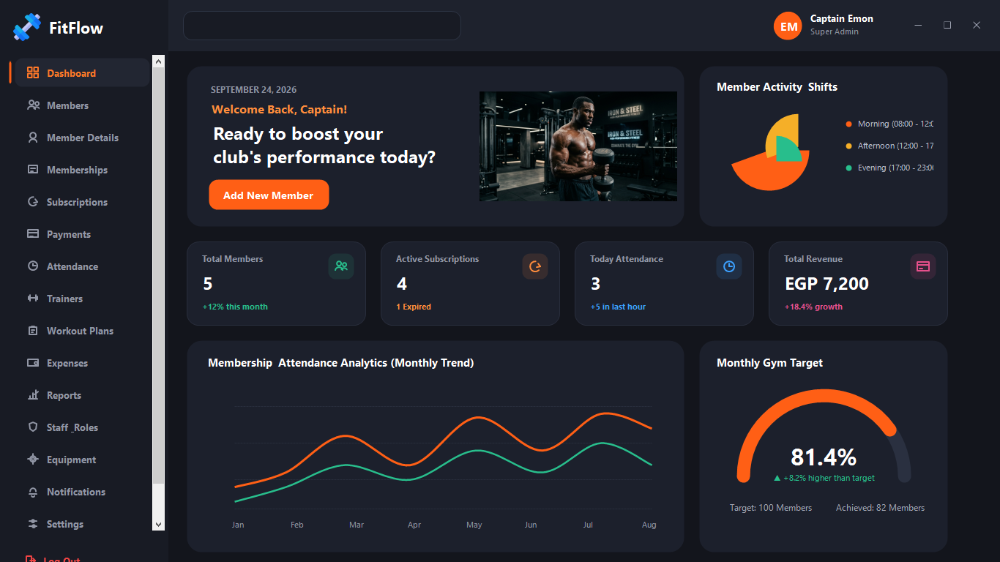 |
| **Members Management** | 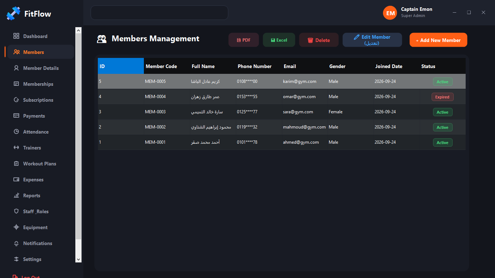 |
| **Member Profile & Details** | 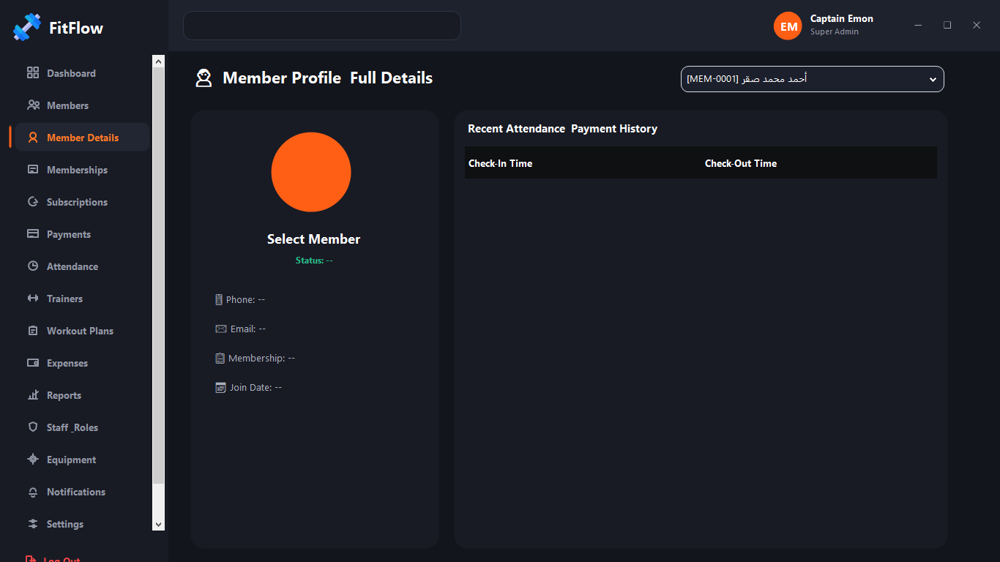 |
| **Membership Packages** | 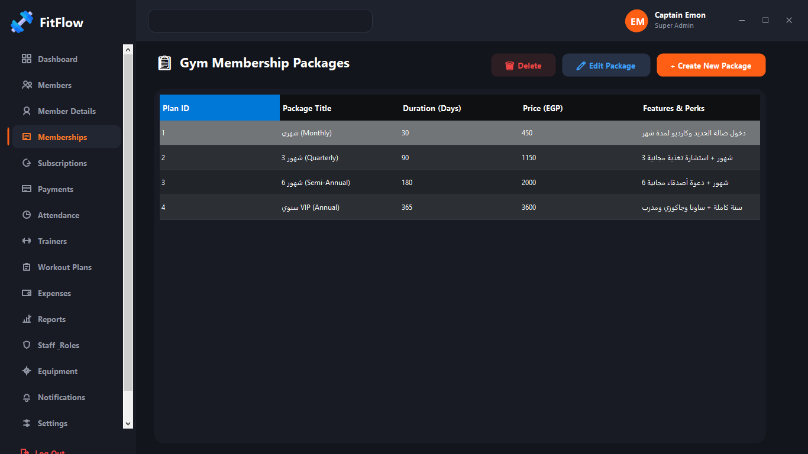 |
| **Subscriptions & Renewals** | 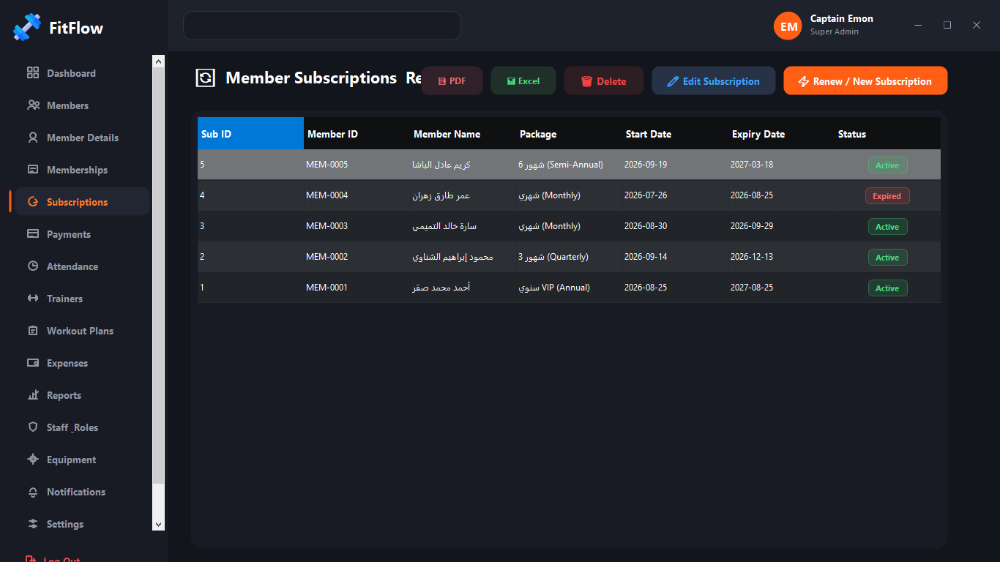 |
| **Payments & Invoices Ledger** | 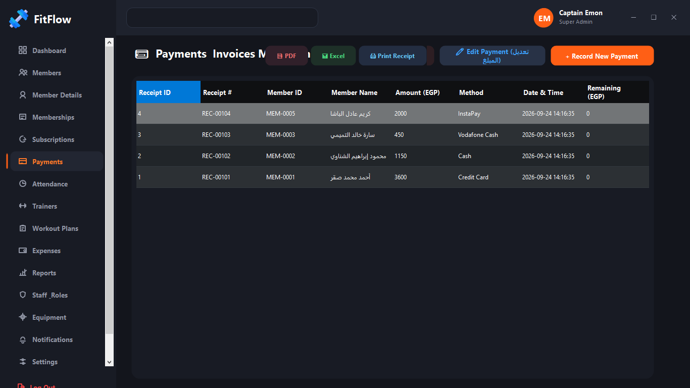 |
| **Attendance Check-in / Check-out** | 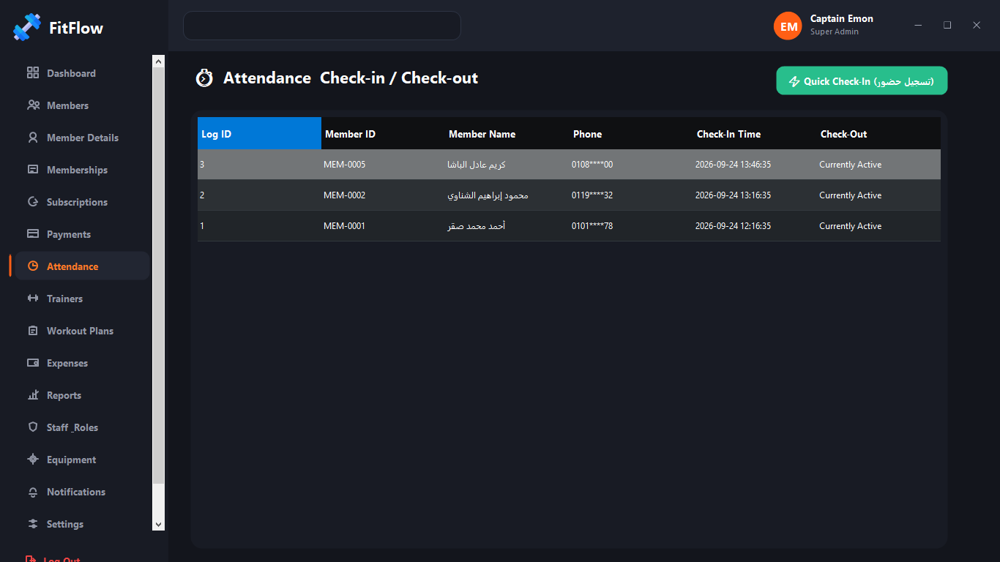 |
| **Trainers & Coaches** | 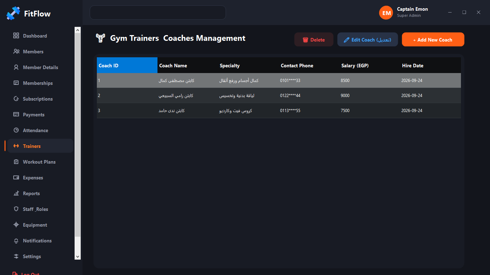 |
| **Workout Plans & Routines** | 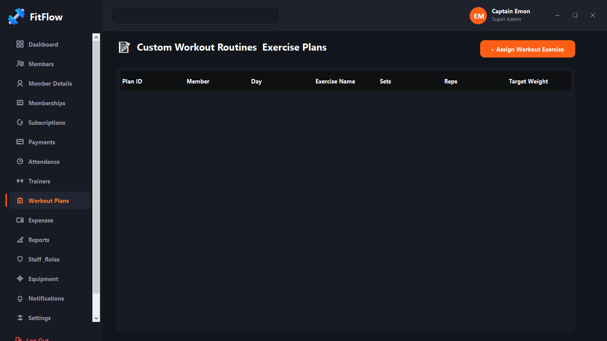 |
| **Operational Expenses** | 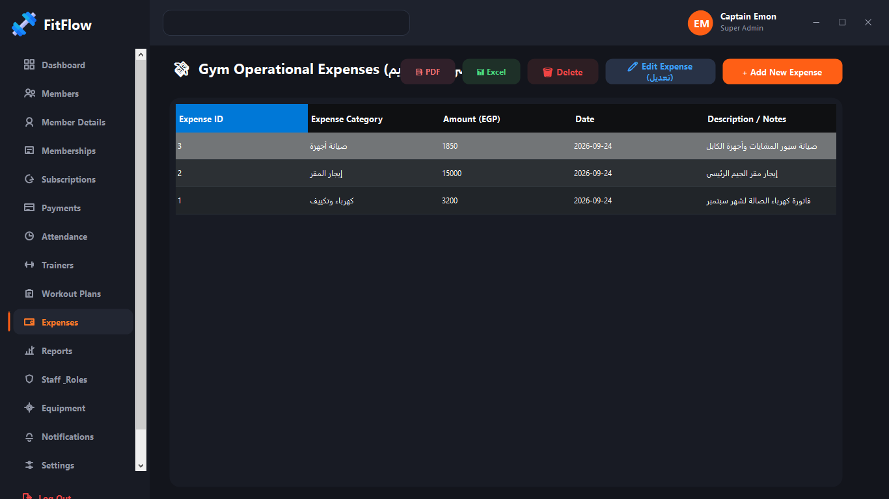 |
| **Financial & Operational Reports** | 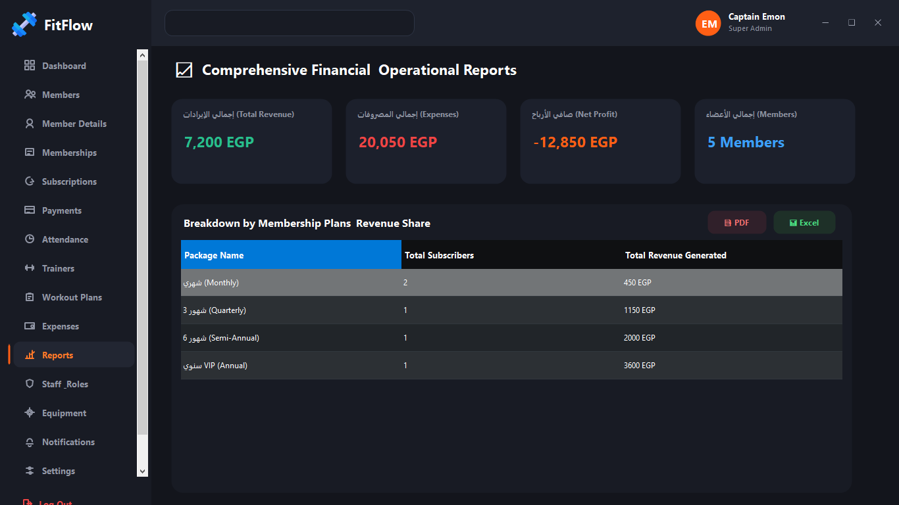 |
| **Staff & User Roles** | 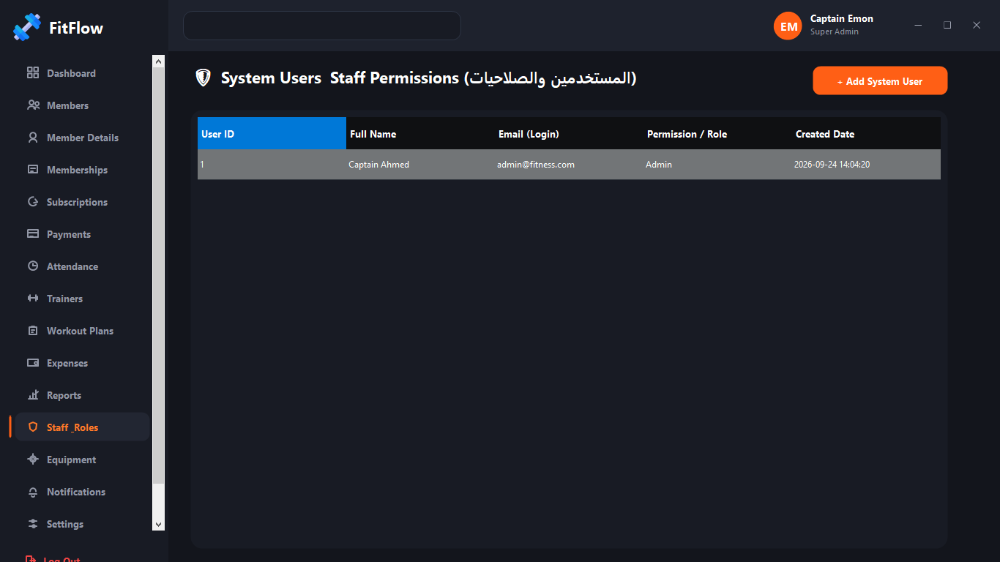 |
| **Equipment & Maintenance** | 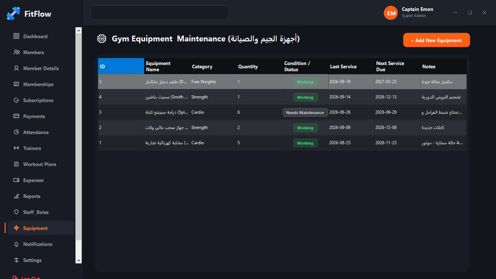 |
| **Subscription Expiry Alerts** | 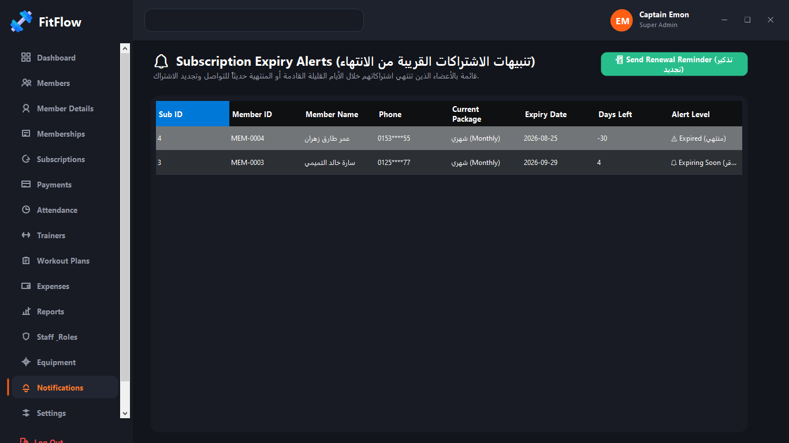 |
| **Gym System Settings** | 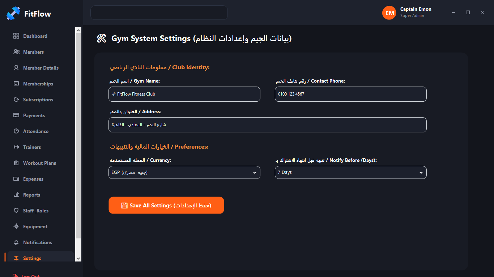 |
| **Database Backup & Restore** | 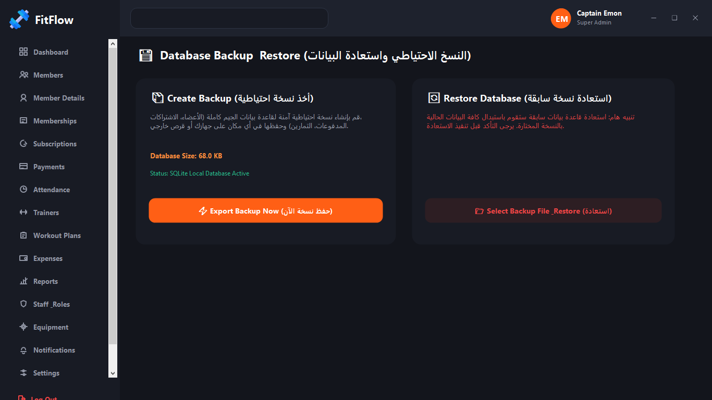 |

---

## License and Attribution

This project is licensed under the MIT License. Designed and maintained for modern fitness club administration.
